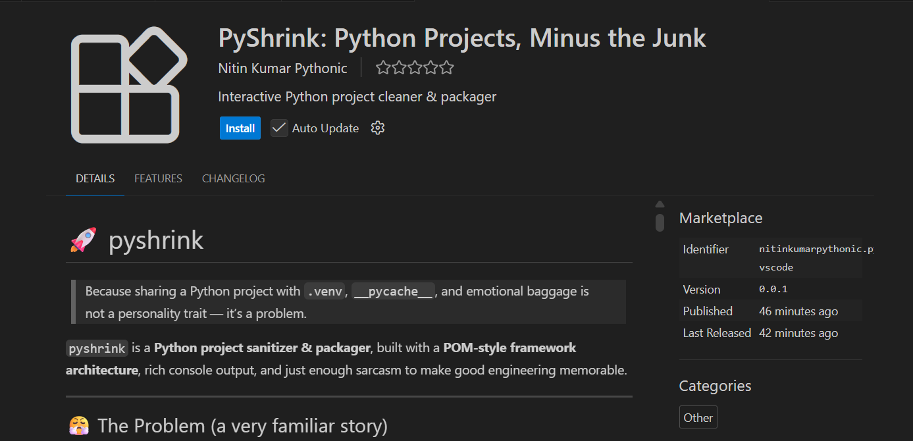

# 🚀 pyshrink

> Because sharing a Python project with `.venv`, `__pycache__`, and emotional baggage
> is not a personality trait — it’s a problem.

`pyshrink` is a **Python project sanitizer & packager**, built with a **POM-style framework architecture**, rich console output, and just enough sarcasm to make good engineering memorable.



---

## 😤 The Problem (a very familiar story)

You want to share a Python project.

You zip the folder.

Inside that zip:

- `.venv/` (why?)
- `__pycache__/` (why x2?)
- `.idea/` (so we know your IDE preferences?)
- `*.pyc` (absolutely unnecessary)

Your teammate:

- deletes half the files
- recreates their own virtualenv anyway
- silently judges you

---

## 😌 The Solution

Run `pyshrink`.

It will:

- 🧹 Clean unnecessary files & folders
- 📦 Package only what *actually matters*
- 📜 Validate (or create) `requirements.txt`
- 📘 Warn you about missing `README.md`
- 🌈 Show **before & after folder structures**
- 🤝 Work in **interactive** *or* **fully automated CLI mode**

And yes — it does all this **without deleting anything important**.

---

## Working


---

## 🧠 Key Idea (Architect Brain Activated)

This project is built using a **POM-inspired modular architecture**.

> Each file does **one job**
> No file knows more than it should
> Chaos is not scalable

Think **Page Object Model**, but for a CLI tool.

---

## 🏗 Project Architecture

```text
pyshrink/
├── pyshrink/
│   ├── __init__.py
│   ├── cli.py          → Argument parsing
│   ├── console.py      → Rich UI, prompts & banners
│   ├── logger.py       → Logging + before/after folder trees
│   ├── inspector.py    → requirements.txt & README logic
│   ├── cleaner.py      → Junk removal rules
│   ├── packager.py     → Zip creation logic
│   ├── config.py       → Centralized constants
│   └── core.py         → Orchestration layer (the brain 🧠)
│
├── main.py             → Single entry point
├── requirements.txt
└── README.md
```

---

## 🔌 How Everything Connects

```text
main.py
   ↓
core.py
   ↓
────────────────────────────────────
| cli | console | logger | inspector |
| cleaner | packager | config        |
────────────────────────────────────
```

### Translation:

* `main.py` → starts the program
* `core.py` → decides **what happens & in what order**
* Other modules → do **one focused task**, nothing more

This makes the code:

* easy to read
* easy to test
* easy to extend
* very hard to accidentally break

---

## 🧹 What Gets Cleaned

Automatically removed:

* `__pycache__/`
* `.pytest_cache/`
* `.idea/`
* `.vscode/`
* `.venv*/`
* `*.pyc`

Nothing else.
No surprises.
No “oops”.

---

## 📦 Output Behavior

If your project is located at:

```text
C:/WinUser/projects/main/chat/project1
```

Then the zip will be created at:

```text
C:/WinUser/projects/main/chat/project1.zip
```

📌 Outside the project directory
📌 Named exactly like the project
📌 Clean enough to send to anyone without apology

---

## 🖥 How to Run pyshrink

### 1️⃣ Interactive Mode (human-friendly)

```bash
python main.py
```

You’ll be asked:

* project path
* whether to create `requirements.txt`
* whether to create `README.md`

Great for first-time use.

---

### 2️⃣ CLI / Automation Mode (CI-friendly)

```bash
python main.py --path "/your/project" --req --readme
```

What this does:

* No questions
* No prompts
* No delays
* Perfect for scripts, pipelines, and power users

---

## 🎨 Rich Console Output

Powered by **Rich**:

* Colored logs
* Folder trees
* Warnings that actually stand out
* Output you won’t hate reading

Because CLI tools deserve UX too.

---


---

## 📦 Requirements

Python 3.9+

```bash
pip install rich
```

That’s it.
No bloated dependency tree.
No drama.

---

## 🧪 Who This Is For

* Developers who share projects often
* Teams tired of bloated zip files
* Architects who judge folder structures quietly
* Anyone who has ever said:

  > “Why is the zip 600MB?”
  >

---

## 🚀 Future Enhancements (Very Easy to Add)

* `.pyshrinkignore`
* `--dry-run`
* Plugin-based cleaners
* pip-installable CLI
* CI/CD integration
* Unit tests per module

This architecture was built **for growth**, not just for today.

---

## 📜 License

MIT.

Do whatever you want.
Just don’t commit `.venv`.

---

## 🏁 Final Note

If someone asks:

> “Why did you structure it this way?”

You can confidently say:

> “Because maintainability is cheaper than regret.”

Happy sharing 🚀


